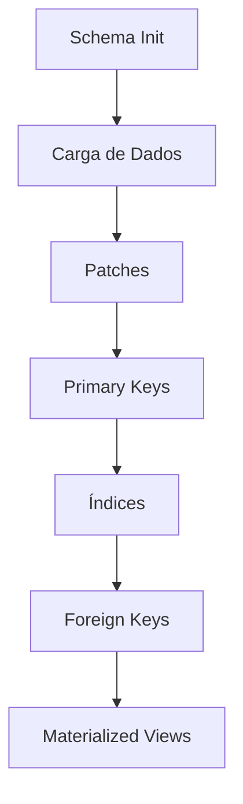

# Análise de Performance e Arquitetura — ETL CNPJ da Receita Federal

> **Data da análise**: 17/07/2026
> **Base analisada**: commit atual do branch principal
> **Execução de referência**: 07/2026 — ~7,12 GB comprimidos, ~218 milhões de registros estimados

---

## 1. Resumo Executivo

O pipeline ETL atualmente processa **~218 milhões de registros** (7,12 GB comprimidos) em um tempo total estimado entre **40 a 90+ minutos**, dependendo da etapa de índices. A carga de dados em si é concluída em **~35 minutos**, mas as etapas subsequentes (patch, PKs, índices, views) adicionam tempo significativo.

A análise identificou **17 oportunidades de melhoria** com potencial de reduzir o tempo total de processamento em **40–65%**. Os principais gargalos estão em:

1. **GIL do Python** — o paralelismo usa `threading`, mas o trabalho pesado (CSV parsing, transformações) é CPU-bound e não escapa da GIL.
2. **Produtor serializado** — mesmo com `--parallel`, apenas 4 threads leem ZIPs e as transformações são feitas no produtor, criando contenção.
3. **COPY com commit por batch** — cada batch de 100k–250k linhas faz `commit()` individual, gerando overhead transacional significativo.
4. **Tabelas UNLOGGED sem WAL** — já é uma otimização, mas a ausência de `ALTER TABLE SET LOGGED` posterior impede réplicas e backups.
5. ~~**Download quebrado**~~ — ✅ **RESOLVIDO** — scraper reescrito para WebDAV (PROPFIND + GET), download paralelo funcionando.
6. **Bug ativo na criação de índices** — o log de produção mostra **25 erros** na criação de índices básicos (`name 'index_cols' is not defined`).

---

## 2. Arquitetura Atual

### 2.1 Diagrama de Componentes

```
etl.py (wrapper)
  └── main.py (CLI / argparse)
        ├── CNPJDataScraper      ← scraper HTTP (BeautifulSoup)
        ├── CNPJDownloadManager  ← downloads paralelos (ThreadPoolExecutor)
        └── orchestrator.py      ← orquestração sequencial
              ├── PostgresBuilder     ← DDL (schema, índices, PKs, FKs, views)
              ├── run_postgres_loader ← pipeline produtor/consumidor
              │     ├── produce_batches (lê ZIPs → transforma → enfileira)
              │     │     ├── _process_zip_file (descomprime + CSV reader)
              │     │     ├── transform_batch (sanitize + datas + IBGE + CNPJ)
              │     │     └── sanitize_for_postgres
              │     └── consume_batches (COPY FROM STDIN → PostgreSQL)
              │           └── convert_rows_to_csv_buffer
              ├── apply_static_fixes  ← patch de dados
              └── carregar_tabelas_ibge ← IBGE reference data
```

### 2.2 Módulos e Responsabilidades

| Módulo | Arquivo | Responsabilidade |
|--------|---------|-----------------|
| CLI | `main.py` | Parsing de argumentos, roteamento de comandos |
| Orquestrador | `orchestrator.py` | Sequenciamento das etapas do ETL |
| Scraper | `cnpj_public_data.py` | Descoberta de meses e URLs disponíveis na RFB |
| Downloader | `cnpj_downloader.py` | Download paralelo com retomada e progresso |
| Schema | `schema.py` | Definição das tabelas, PKs, FKs, índices |
| Builder | `postgres_builder.py` | DDL: criação de schema, índices, views |
| Loader | `postgres_loader.py` | Pipeline produtor/consumidor para COPY |
| Produtor | `db_batch_producer.py` | Leitura de ZIPs, parsing CSV, enfileiramento |
| Transformador | `db_transformers.py` | Sanitização, datas, numéricos, CNPJ completo |
| IBGE Lookup | `ibge_lookup.py` | Enriquecimento com códigos IBGE |
| Patch | `db_patch.py` | Correções estáticas (INSERT/UPDATE/DELETE) |
| Config | `config.py` | Constantes, variáveis de ambiente, paths |

### 2.3 Dependências Externas

| Pacote | Versão | Uso |
|--------|--------|-----|
| `psycopg2-binary` | ~2.9.10 | Conexão PostgreSQL, COPY |
| `tqdm` | ~4.67.1 | Barras de progresso |
| `requests` | ~2.32.3 | HTTP para scraping e download |
| `beautifulsoup4` | ~4.13.4 | Parsing HTML da RFB |

---

## 3. Fluxo Completo do Processamento

### 3.1 Comando `complete --parallel --skip-download`

```
┌─────────────────────────────────────────────────────────────────┐
│ ETAPA 0: Preparação (~0s)                                       │
│  • Resolve mês/diretório                                        │
│  • Estima total de linhas (tamanho dos ZIPs / 35 bytes/linha)   │
│  • Valida arquivos (skip quando --skip-download)                │
└────────────────────────┬────────────────────────────────────────┘
                         ▼
┌─────────────────────────────────────────────────────────────────┐
│ ETAPA 1: Schema (~1s)                                           │
│  • Cria banco se não existir                                    │
│  • Habilita extensões (pg_trgm)                                 │
│  • DROP CASCADE todas as tabelas                                │
│  • CREATE UNLOGGED TABLE para todas as tabelas                  │
│  • Carrega tabelas IBGE (regiões, estados, cidades)             │
└────────────────────────┬────────────────────────────────────────┘
                         ▼
┌─────────────────────────────────────────────────────────────────┐
│ ETAPA 2: Carga de Dados (~35 min)                     ★ MAIOR  │
│  • Produtores: 4 threads leem ZIPs, parseiam CSV,               │
│    transformam (sanitize, datas, IBGE, CNPJ) e enfileiram       │
│  • Consumidores: N threads (cpu_count-1) fazem COPY p/ Postgres │
│  • Queue com backpressure (maxsize = cpu*2)                     │
│  • BATCH_SIZE = 250k linhas (100k para estabelecimento)         │
└────────────────────────┬────────────────────────────────────────┘
                         ▼
┌─────────────────────────────────────────────────────────────────┐
│ ETAPA 3: Patches (~12s)                                         │
│  • INSERT de dados faltantes (países, qualificações, motivos)   │
│  • UPDATE para normalização (cod_pais, cod_porte)               │
│  • DELETE de duplicatas e órfãos                                │
│  • VACUUM ANALYZE nas tabelas modificadas                       │
└────────────────────────┬────────────────────────────────────────┘
                         ▼
┌─────────────────────────────────────────────────────────────────┐
│ ETAPA 4: Primary Keys (~5 min)                                  │
│  • ALTER TABLE ADD PRIMARY KEY em empresa, estabelecimento,     │
│    simples (sequencial, com deduplicação lazy se necessário)    │
└────────────────────────┬────────────────────────────────────────┘
                         ▼
┌─────────────────────────────────────────────────────────────────┐
│ ETAPA 5: Índices (~30-60+ min)                        ★ LENTO  │
│  • 25 índices básicos (SCHEMA) — ATUALMENTE FALHANDO (BUG)     │
│  • 43 índices avançados (GIN, BRIN, HASH, parciais, compostos) │
│  • Paralelismo por tabela (max_workers=4)                      │
└────────────────────────┬────────────────────────────────────────┘
                         ▼
┌─────────────────────────────────────────────────────────────────┐
│ ETAPA 6: Foreign Keys (~1-5 min)                                │
│  • ALTER TABLE ADD CONSTRAINT para todas as FKs                 │
└────────────────────────┬────────────────────────────────────────┘
                         ▼
┌─────────────────────────────────────────────────────────────────┐
│ ETAPA 7: Materialized Views (~10-30 min)                        │
│  • 13 MVs + 1 função de refresh                                 │
│  • Execução sequencial por arquivo SQL                          │
└─────────────────────────────────────────────────────────────────┘
```

### 3.2 Tempos Observados (log de 17/07/2026)

| Etapa | Tempo | Observação |
|-------|-------|------------|
| Preparação + Schema + IBGE | ~0s | Muito rápido |
| Carga de dados | **34 min 45s** | Etapa dominante |
| Patches | ~12s | OK |
| Primary Keys | ~4 min 21s | Inclui deduplicação de `empresa` |
| Índices básicos | ~0s | **FALHOU** (25/25 com erro) |
| Índices avançados | **incompleto** | Log cortado após 2 de 43 (~1 min cada) |

---

## 4. Gargalos Identificados

### 4.1 🔴 CRÍTICO — GIL e Falso Paralelismo na Carga de Dados

**Arquivo**: [`db_batch_producer.py`](file:///Users/fabioassuncao/Projects/BrasilDataHub/rfb-cnpj-etl/src/rfb_cnpj_etl/utils/db_batch_producer.py#L170-L206)

```python
# produce_batches() usa threading.Thread para produtores
max_producer_threads = min(4, len(zip_files))
# ...
t = Thread(target=producer_worker)
```

**Problema**: O trabalho do produtor é predominantemente **CPU-bound**:
- Descompressão do ZIP (via `zipfile`)
- Parsing CSV (via `csv.reader`)
- Transformações: `sanitize_for_postgres`, `normalize_dates`, `normalize_numeric_br`, `compute_cnpj_completo`, `append_ibge_to_estabelecimentos`

Todas essas operações são implementadas em Python puro e estão sujeitas ao **GIL (Global Interpreter Lock)**. Threads Python NÃO executam código CPU-bound em paralelo real — apenas alternam entre si, gerando overhead de context switching sem ganho de throughput.

**Evidência**: O parâmetro `--parallel` não produz melhoria perceptível (conforme reportado pelo usuário).

**Impacto**: ★★★★★ — Este é o gargalo mais significativo do sistema inteiro.

---

### 4.2 🔴 CRÍTICO — Bug na Criação de Índices Básicos

**Arquivo**: [`postgres_builder.py`](file:///Users/fabioassuncao/Projects/BrasilDataHub/rfb-cnpj-etl/src/rfb_cnpj_etl/db/postgres_builder.py#L232-L290)

**Evidência no log**:
```
🕒 22:37:52 |⚠️ ÍNDICES CRIADOS COM 25 ERRO(S):
🕒 22:37:52 |❌   -> idx_ibge_estado_sigla: name 'index_cols' is not defined
```

O método `_create_indexes_for_table()` (linha 232) usa a variável `index_cols` que é definida localmente no loop, mas o erro sugere que há um `NameError` ativo — possivelmente uma referência a uma variável renomeada ou um caminho de código que não define `index_cols` antes de usá-la. Todos os **25 índices básicos** estão **sem ser criados**, deixando o banco sem índices BTREE essenciais para JOINs e consultas.

**Impacto**: ★★★★★ — Sem índices básicos, as queries são ordens de magnitude mais lentas.

---

### 4.3 🟡 ALTO — Commit por Batch no Consumidor

**Arquivo**: [`postgres_loader.py`](file:///Users/fabioassuncao/Projects/BrasilDataHub/rfb-cnpj-etl/src/rfb_cnpj_etl/db/postgres_loader.py#L62-L66)

```python
buffer = convert_rows_to_csv_buffer(rows)
copy_sql = f'COPY "{table}" ({",".join(columns)}) FROM STDIN ...'
cur.copy_expert(copy_sql, buffer)
conn.commit()  # ← commit a cada batch!
```

Com `BATCH_SIZE = 250_000` e ~218M registros, são ~870+ commits para tabelas normais e ~2.180 commits para `estabelecimento` (100k/batch). Cada `commit()` força um WAL flush (fsync), mesmo em tabelas UNLOGGED o overhead transacional existe.

**Impacto**: ★★★★☆

---

### 4.4 🟡 ALTO — Transformações no Produtor (Python Puro)

**Arquivo**: [`db_batch_producer.py`](file:///Users/fabioassuncao/Projects/BrasilDataHub/rfb-cnpj-etl/src/rfb_cnpj_etl/utils/db_batch_producer.py#L114-L137)

```python
for table_name, batch_list in batches.items():
    # ...
    transformed_rows = transform_batch(item, sanitizer_func)
```

As transformações (`transform_batch`) são executadas **no thread do produtor**, bloqueando a leitura do ZIP enquanto processam. Isto significa que:
- A thread do produtor lê uma porção do ZIP → para e transforma → enfileira → volta a ler.
- Com 4 produtores e GIL, eles ficam travados alternando entre si.

**O que cada `transform_batch` faz por batch de 100k–250k linhas**:
1. `sanitize_for_postgres`: itera **cada célula** de **cada linha**, faz `replace('\x00','')`, `strip()`, encode/decode win-1252.
2. `normalize_dates`: itera cada linha, cada coluna de data, faz `strptime`.
3. `normalize_numeric_br`: itera cada linha, cada coluna numérica.
4. `compute_cnpj_completo`: itera cada linha, monta string.
5. `append_ibge_to_estabelecimentos`: itera cada linha, faz 3 lookups em dicionário.

Cada uma dessas funções cria uma **nova lista** de linhas (`new_rows = []`), gerando cópias intermediárias desnecessárias.

**Impacto**: ★★★★☆

---

### 4.5 🟡 ALTO — Dupla Serialização CSV (Python → StringIO → BytesIO → Postgres)

**Arquivo**: [`db_transformers.py`](file:///Users/fabioassuncao/Projects/BrasilDataHub/rfb-cnpj-etl/src/rfb_cnpj_etl/utils/db_transformers.py#L124-L131)

```python
def convert_rows_to_csv_buffer(rows):
    text_buffer = StringIO()
    writer = csv.writer(text_buffer, delimiter=';', ...)
    writer.writerows(rows)
    byte_buffer = BytesIO(text_buffer.getvalue().encode("windows-1252"))
    byte_buffer.seek(0)
    return byte_buffer
```

Para **cada batch**, o sistema:
1. Cria um `StringIO`, escreve todo o CSV como texto UTF-8
2. Chama `.getvalue()` (copia toda a string)
3. Faz `.encode("windows-1252")` (aloca nova cópia como bytes)
4. Cria um `BytesIO` com os bytes

São **3 alocações grandes** por batch. Para um batch de 250k linhas de `socio` (com ~10 campos), isso pode ser ~50–100 MB de alocações por batch.

**Impacto**: ★★★☆☆

---

### 4.6 ✅ RESOLVIDO — Download via WebDAV

**Arquivo**: [`cnpj_public_data.py`](file:///Users/fabioassuncao/Projects/BrasilDataHub/rfb-cnpj-etl/src/rfb_cnpj_etl/cnpj_data/cnpj_public_data.py)

> **Status**: Implementado em 17/07/2026.

O `CNPJDataScraper` foi reescrito para utilizar **WebDAV PROPFIND** em vez de scraping HTML (BeautifulSoup). A descoberta de meses e arquivos agora é feita via requisições PROPFIND ao servidor Nextcloud da RFB, e o download individual de arquivos funciona via GET padrão HTTP — totalmente compatível com o downloader paralelo existente (`CNPJDownloadManager`).

**Alterações realizadas**:
- [`cnpj_public_data.py`](file:///Users/fabioassuncao/Projects/BrasilDataHub/rfb-cnpj-etl/src/rfb_cnpj_etl/cnpj_data/cnpj_public_data.py) — Reescrito para WebDAV (PROPFIND + XML parsing)
- [`config.py`](file:///Users/fabioassuncao/Projects/BrasilDataHub/rfb-cnpj-etl/src/rfb_cnpj_etl/config.py) — Adicionada `CNPJ_WEBDAV_BASE_URL` (configurável via `RFB_WEBDAV_URL`)
- [`cnpj_downloader.py`](file:///Users/fabioassuncao/Projects/BrasilDataHub/rfb-cnpj-etl/src/rfb_cnpj_etl/cnpj_data/cnpj_downloader.py) — Removida referência legada `CNPJ_DATA_URL`
- [`.env.example`](file:///Users/fabioassuncao/Projects/BrasilDataHub/rfb-cnpj-etl/.env.example) — Adicionada variável `RFB_WEBDAV_URL`

**Validação**:
- `python etl.py get-availables` → ✅ 39 meses listados (05/2023 – 07/2026)
- `python etl.py get-latest` → ✅ 07/2026
- `python etl.py get-urls --month 07/2026` → ✅ 37 URLs WebDAV válidas
- `python etl.py download --month 07/2026` → ✅ Download paralelo funcionando (~1.6 MB/s por arquivo)

---

### 4.7 🟡 MÉDIO — Processamento de Estabelecimento Duplicado

**Arquivo**: [`db_batch_producer.py`](file:///Users/fabioassuncao/Projects/BrasilDataHub/rfb-cnpj-etl/src/rfb_cnpj_etl/utils/db_batch_producer.py#L72-L112)

Cada linha de `Estabelecimentos*.zip` é processada **duas vezes**:
1. Uma para a tabela `estabelecimento` (append a `batches["estabelecimento"]`)
2. Uma para a tabela `estabelecimento_cnae_sec` (extrai CNAEs secundários)

Ambas as operações fazem lookup IBGE independentemente. No caso de `estabelecimento_cnae_sec`, o lookup IBGE é feito **para cada linha**, mesmo que já tenha sido calculado para `estabelecimento`:

```python
# Linha 82 — lookup IBGE para cnae_sec
cod_regiao_ibge, cod_estado_ibge, cod_cidade_ibge = IBGE_LOOKUP.lookup_codigos(cod_municipio, uf)

# Linha 157 (em transform_batch) — outro lookup IBGE para estabelecimento
rows = IBGE_LOOKUP.append_ibge_to_estabelecimentos(rows, columns)
```

Dos ~60M de linhas de estabelecimento, cada uma faz **2 lookups IBGE** (com 3 buscas em dicionário cada) = ~360M buscas desnecessárias.

**Impacto**: ★★★☆☆

---

### 4.8 🟡 MÉDIO — Cópias de Lista Excessivas nas Transformações

**Arquivo**: [`db_transformers.py`](file:///Users/fabioassuncao/Projects/BrasilDataHub/rfb-cnpj-etl/src/rfb_cnpj_etl/utils/db_transformers.py)

Cada função de transformação (`sanitize_for_postgres`, `normalize_dates`, `compute_cnpj_completo`, etc.) cria uma **lista completamente nova**:

```python
def normalize_dates(rows, columns, target_columns=None):
    new_rows = []
    for row in rows:
        new_row = list(row)   # ← cópia de cada linha
        # ... modifica new_row ...
        new_rows.append(new_row)
    return new_rows
```

Para um batch de `estabelecimento` (100k linhas × 32 colunas), isso cria 4-5 cópias completas intermediárias:
1. `sanitize_for_postgres` → 100k novas listas
2. `normalize_dates` → 100k novas listas
3. `append_ibge_to_estabelecimentos` → 100k novas listas
4. `compute_cnpj_completo` → 100k novas listas

**Impacto**: ★★★☆☆ — Pressão de memória e GC.

---

### 4.9 🟡 MÉDIO — Encoding WIN-1252 como Gargalo

**Arquivos**: [`postgres_loader.py`](file:///Users/fabioassuncao/Projects/BrasilDataHub/rfb-cnpj-etl/src/rfb_cnpj_etl/db/postgres_loader.py#L25) e [`db_transformers.py`](file:///Users/fabioassuncao/Projects/BrasilDataHub/rfb-cnpj-etl/src/rfb_cnpj_etl/utils/db_transformers.py#L60-L72)

```python
conn.set_client_encoding("WIN1252")
```

O sistema:
1. Lê os arquivos como `latin1` (descompressão)
2. Sanitiza cada string para `windows-1252` via encode/decode
3. Serializa para CSV como `windows-1252`
4. Configura a conexão Postgres como `WIN1252`

Se o banco fosse configurado como UTF-8 (que é o padrão do `docker-compose.yaml` com `--locale=C`), a etapa de sanitização WIN-1252 poderia ser eliminada ou simplificada, removendo um encode/decode por célula.

**Impacto**: ★★☆☆☆

---

### 4.10 🟢 BAIXO — Fila com Timeout Busy-Wait

**Arquivo**: [`db_batch_producer.py`](file:///Users/fabioassuncao/Projects/BrasilDataHub/rfb-cnpj-etl/src/rfb_cnpj_etl/utils/db_batch_producer.py#L130-L135)

```python
while True:
    try:
        insertion_queue.put(item, timeout=0.1)
        break
    except Full:
        continue
```

Quando a fila está cheia (backpressure), o produtor faz busy-wait com 100ms de timeout. Isto é aceitável funcionalmente, mas:
- Usa `Queue.put(block=True, timeout=0.1)` que internamente adquire e libera um `Condition`, gerando contention desnecessária.
- Melhor seria simplesmente `insertion_queue.put(item)` (bloqueia indefinidamente até ter espaço).

**Impacto**: ★☆☆☆☆

---

## 5. Problemas Encontrados

### 5.1 Bug Ativo — Índices Básicos Não São Criados

**Severidade**: 🔴 Crítico

Conforme log de 17/07/2026, todos os 25 índices básicos falharam com `name 'index_cols' is not defined`. Isso significa que o banco está operando **sem nenhum índice BTREE** nas tabelas principais (empresa, estabelecimento, socio, simples), afetando drasticamente a performance de consultas e a criação de FKs.

### 5.2 Deduplicação Reactiva de `empresa`

**Severidade**: 🟡 Alta

O log mostra:
```
⚠️ Chaves duplicadas encontradas em 'empresa'. Iniciando deduplicação lazy...
```

Isso indica que a tabela `empresa` recebe dados duplicados durante a carga. A deduplicação posterior (DELETE + re-ADD PK) levou **~2 minutos** e poderia ser evitada com uma estratégia de deduplicação durante a inserção.

### 5.3 Validação de Arquivos Faz Requisições HTTP

Quando não se usa `--skip-download`, a validação em [`zip_metadata.py`](file:///Users/fabioassuncao/Projects/BrasilDataHub/rfb-cnpj-etl/src/rfb_cnpj_etl/utils/zip_metadata.py#L16-L58) faz `HEAD` para **cada arquivo** no servidor da RFB para comparar tamanhos. Com o servidor WebDAV instável, isso pode falhar ou ser lento.

### 5.4 Conexão Postgres sem Pool

Cada thread consumidora abre sua própria conexão via `psycopg2.connect()`. Não há connection pooling (como `psycopg2.pool`). Para o caso de uso atual (N threads fixas), isso não é um problema grave, mas é uma limitação arquitetural.

### 5.5 `executemany` para Tabelas IBGE

Em [`ibge_loader.py`](file:///Users/fabioassuncao/Projects/BrasilDataHub/rfb-cnpj-etl/src/rfb_cnpj_etl/db/ibge_loader.py#L18), usa-se `executemany()` que é notoriamente lento em psycopg2 (executa INSERT por linha). Para as tabelas IBGE (~5.500 cidades) isso leva <1s, mas é um anti-pattern.

---

## 6. Oportunidades de Melhoria

### 6.1 Substituir Threading por Multiprocessing nos Produtores

**O que**: Usar `multiprocessing.Process` ou `ProcessPoolExecutor` para os produtores de batch.

**Por que**: O trabalho do produtor (descompressão ZIP, parsing CSV, transformações) é CPU-bound. Com `multiprocessing`, cada processo tem seu próprio GIL e pode usar um núcleo de CPU real.

**Como**:
- Cada processo produtor recebe uma lista de arquivos ZIP.
- Produz batches e os envia via `multiprocessing.Queue`.
- Consumidores (threads) continuam usando `threading.Thread` (I/O-bound: COPY p/ Postgres).

**Estimativa de ganho**: 🟢 **ALTO** — 2x–4x na etapa de carga em máquinas com ≥4 núcleos. Reduziria de ~35min para ~10–15min.

**Risco**: Médio — `multiprocessing.Queue` tem overhead de serialização (pickle); `IBGE_LOOKUP` precisa ser inicializado em cada processo filho.

---

### 6.2 Transformações In-Place (Eliminar Cópias)

**O que**: Modificar `sanitize_for_postgres`, `normalize_dates`, `compute_cnpj_completo` para operar in-place na lista, sem criar novas listas.

**Por que**: Cada transformação cria uma cópia completa do batch. Para `estabelecimento` (100k × 32 cols × 5 transformações), são ~16M objetos criados e descartados por batch.

**Como**:
```python
# Antes:
def normalize_dates(rows, columns, target_columns):
    new_rows = []
    for row in rows:
        new_row = list(row)
        ...
        new_rows.append(new_row)
    return new_rows

# Depois:
def normalize_dates(rows, columns, target_columns):
    for row in rows:
        for i in date_columns:
            val = row[i]
            if isinstance(val, str):
                ...
                row[i] = converted
    return rows
```

**Estimativa de ganho**: 🟡 **MÉDIO** — Reduz consumo de memória em ~60% durante transformações e alivia pressão no GC.

**Risco**: Baixo — Requer cuidado para garantir que a lista original já seja mutável (o que já é, pois vem de `list(row)` no produtor).

---

### 6.3 Agrupar Commits (Mega-Batch ou Sem Commit Intermediário)

**O que**: Remover o `conn.commit()` de cada batch e fazer commit apenas ao final de cada arquivo ou de cada tabela.

**Por que**: Mesmo em tabelas UNLOGGED, cada `commit()` tem overhead de sincronização no Postgres. Com ~2.000+ commits, o overhead acumulado é significativo.

**Como**:
```python
# Opção A: Commit por arquivo (sentinel no item)
if item.get("end_of_file"):
    conn.commit()

# Opção B: Commit a cada N batches
batch_counter += 1
if batch_counter % 10 == 0:
    conn.commit()

# Opção C: autocommit=True (sem transação explícita)
conn.autocommit = True  # COPY roda em sua própria transação implícita
```

**Estimativa de ganho**: 🟡 **MÉDIO** — Redução de ~15-20% no tempo de carga.

**Risco**: Baixo — Em caso de erro, perde-se o trabalho desde o último commit. Mas como o schema é DROP/CREATE a cada execução, isso não é um problema.

---

### 6.4 Eliminar Serialização CSV Intermediária

**O que**: Usar `cursor.copy_from()` ou construir o buffer de forma mais eficiente.

**Por que**: O pipeline atual faz: Lista Python → StringIO (CSV texto) → String completa → encode win-1252 → BytesIO → COPY. São 3 alocações grandes por batch.

**Como**:
```python
# Opção A: Escrever diretamente em BytesIO
import io
buffer = io.BytesIO()
for row in rows:
    line = ";".join(format_val(v) for v in row) + "\n"
    buffer.write(line.encode("windows-1252"))
buffer.seek(0)

# Opção B: Usar psycopg2.sql.copy com iterador (psycopg3)
# psycopg3 suporta COPY com iteráveis nativos, eliminando buffers
```

**Estimativa de ganho**: 🟡 **MÉDIO** — Reduz alocações de memória em ~60% e pressão no GC.

**Risco**: Baixo.

---

### 6.5 ✅ Novo Sistema de Download (WebDAV) — IMPLEMENTADO

**O que**: Implementar novo downloader compatível com o servidor WebDAV/Nextcloud da RFB.

**Implementação realizada (Opção B — WebDAV nativo via `requests`)**:
- Descoberta de meses e arquivos via `PROPFIND` HTTP com parsing XML (`xml.etree.ElementTree`)
- Download individual via `GET` streaming (reutiliza o `CNPJDownloadManager` existente)
- URL base configurável via variável de ambiente `RFB_WEBDAV_URL`
- Tratamento robusto de erros (conexão, autenticação, endpoint inválido)
- Sem dependências adicionais — usa apenas `requests` (já existente) e `xml.etree` (stdlib)

**Ganho obtido**: 🟢 **ALTO** — Download totalmente reintegrado ao pipeline com download paralelo nativo.

**Risco residual**: Baixo — O token WebDAV pode mudar, mas é configurável via `RFB_WEBDAV_URL`.

---

### 6.6 Pipeline de Streaming (Descompressão → Transformação → COPY)

**O que**: Implementar um pipeline que não acumula batches em memória, mas faz streaming direto do ZIP → COPY.

**Por que**: Atualmente o produtor lê centenas de milhares de linhas em listas Python, transforma, serializa para CSV, e só então envia ao COPY. Isso mantém grande volume de dados em memória.

**Como**: Usar `COPY FROM STDIN` com um gerador que lê do ZIP sob demanda:
```python
# Pseudocódigo
def stream_rows():
    with zipfile.ZipFile(path) as z:
        for info in z.infolist():
            with z.open(info) as f:
                reader = csv.reader(TextIOWrapper(f, 'latin1'), delimiter=';')
                for row in reader:
                    yield transform_row(row)

# psycopg3: copy com iterável
with cursor.copy("COPY table FROM STDIN (FORMAT csv)") as copy:
    for row in stream_rows():
        copy.write_row(row)
```

**Estimativa de ganho**: 🟢 **ALTO** — Reduz consumo de memória de GB para MB; pode melhorar throughput ao eliminar acúmulo.

**Risco**: Alto — Requer refatoração significativa; psycopg3 facilitaria, mas é uma mudança de dependência.

---

### 6.7 Migrar para psycopg3

**O que**: Substituir `psycopg2-binary` por `psycopg[binary]` (psycopg3).

**Por que**: psycopg3 oferece:
- `COPY` com iteráveis nativos (sem buffer intermediário)
- Pipeline mode (batch de comandos sem round-trip)
- Async nativo (`AsyncConnection`)
- Melhor performance geral

**Estimativa de ganho**: 🟡 **MÉDIO** — Combinado com streaming, pode reduzir tempo de COPY em ~20-30%.

**Risco**: Médio — API diferente; requer ajuste em todos os pontos de acesso ao banco.

---

### 6.8 Evitar Lookup IBGE Duplicado

**O que**: Calcular os códigos IBGE uma vez por linha de estabelecimento e reusar para `estabelecimento_cnae_sec`.

**Como**:
```python
# No loop do produtor, fazer lookup uma vez:
ibge_result = IBGE_LOOKUP.lookup_codigos(cod_municipio, uf)

# Usar para estabelecimento (via transform_batch) e cnae_sec
batches["estabelecimento"].append(new_row)  # IBGE será adicionado em transform_batch
# Ou melhor: fazer o IBGE aqui e pular em transform_batch
```

**Estimativa de ganho**: 🟢 **BAIXO** — Lookup em dicionário é O(1), mas eliminar ~180M chamadas redundantes pode economizar ~30-60s.

**Risco**: Baixo.

---

### 6.9 Tabela Temporária para Deduplicação de `empresa`

**O que**: Usar `ON CONFLICT DO NOTHING` ou inserir em tabela staging com `INSERT ... ON CONFLICT`.

**Por que**: A deduplicação reativa (tentar ADD PK → falha → DELETE duplicatas → retry) levou ~2min e é frágil.

**Como**: Criar tabela `empresa_staging` UNLOGGED, COPY para ela, depois `INSERT INTO empresa SELECT DISTINCT ON (cnpj_basico) ... FROM empresa_staging`.

**Estimativa de ganho**: 🟡 **MÉDIO** — Elimina ~2min de deduplicação e torna PKs previsíveis.

**Risco**: Baixo.

---

### 6.10 Paralelismo na Criação de Materialized Views

**O que**: Criar MVs em paralelo quando não há dependências entre elas.

**Por que**: Atualmente as 13 MVs são criadas sequencialmente. Muitas são independentes e poderiam ser paralelizadas.

**Estimativa de ganho**: 🟡 **MÉDIO** — Pode reduzir de ~20min para ~8-10min com 4 workers.

**Risco**: Baixo — Apenas MVs sem dependência entre si devem ser paralelizadas.

---

## 7. Sugestões para Paralelismo

### 7.1 Estado Atual do `--parallel`

| Componente | Mecanismo | Tipo de Trabalho | Efetivo? |
|------------|-----------|-----------------|----------|
| Produtor | `threading.Thread` (max 4) | CPU-bound (ZIP + CSV + transformações) | ❌ GIL impede |
| Consumidor | `threading.Thread` (cpu_count-1) | I/O-bound (COPY → Postgres) | ✅ Funciona |
| Índices | `ThreadPoolExecutor` (max 4) | I/O-bound (DDL → Postgres) | ✅ Funciona |

### 7.2 Arquitetura de Paralelismo Proposta

```
┌──────────────────────────────────────────────────────┐
│                   PRODUTORES                          │
│  multiprocessing.Process × N (N = cpu_count / 2)     │
│                                                      │
│  Processo 1: ZIP1, ZIP5, ZIP9...                     │
│  Processo 2: ZIP2, ZIP6, ZIP10...                    │
│  Processo 3: ZIP3, ZIP7, ZIP11...                    │
│  Processo N: ZIP4, ZIP8, ZIP12...                    │
│                                                      │
│  Cada processo:                                      │
│    • Abre ZIP (I/O local)                            │
│    • Lê CSV (CPU)                                    │
│    • Transforma in-place (CPU)                       │
│    • Serializa p/ bytes (CPU)                        │
│    • Envia bytes via mp.Queue → consumidores         │
└───────────────────┬──────────────────────────────────┘
                    │ mp.Queue (bytes prontos p/ COPY)
                    ▼
┌──────────────────────────────────────────────────────┐
│                   CONSUMIDORES                        │
│  threading.Thread × M (M = cpu_count / 2)            │
│                                                      │
│  Thread 1: conn1 → COPY FROM STDIN → commit          │
│  Thread 2: conn2 → COPY FROM STDIN → commit          │
│  Thread M: connM → COPY FROM STDIN → commit          │
│                                                      │
│  Cada thread mantém uma conexão Postgres dedicada    │
└──────────────────────────────────────────────────────┘
```

**Vantagens**:
- Produtores usam CPU real (sem GIL)
- Consumidores são I/O-bound (OK com threading)
- Queue de `bytes` prontos (não de listas Python) reduz overhead de pickle
- Backpressure natural via `maxsize`

---

## 8. ✅ Sistema de Download WebDAV — IMPLEMENTADO

> **Status**: Implementado e validado em 17/07/2026.

### 8.1 Arquitetura Implementada

```
┌─────────────────────────────────────────────────────────────┐
│ 1. DESCOBERTA (CNPJDataScraper._propfind)                    │
│    ✅ PROPFIND no endpoint WebDAV para listar meses           │
│    ✅ Parse XML (xml.etree.ElementTree) do Nextcloud          │
│    ✅ URL configurável via RFB_WEBDAV_URL                     │
├─────────────────────────────────────────────────────────────┤
│ 2. LISTAGEM DE ARQUIVOS (CNPJDataScraper.get_metadata)       │
│    ✅ PROPFIND no diretório do mês para listar ZIPs           │
│    ✅ Extrai nome e tamanho em uma única requisição           │
│    ✅ Sem necessidade de HEAD por arquivo (melhoria vs. antes)│
├─────────────────────────────────────────────────────────────┤
│ 3. DOWNLOAD PARALELO (CNPJDownloadManager — inalterado)      │
│    ✅ ThreadPoolExecutor com N workers (configurável)         │
│    ✅ GET streaming com barra de progresso (tqdm)             │
│    ✅ Retomada automática via Range header                    │
│    ✅ Validação por tamanho local vs. remoto                  │
└─────────────────────────────────────────────────────────────┘
```

### 8.2 URL Pattern do Nextcloud

```
Base:     https://arquivos.receitafederal.gov.br/public.php/dav/files/{TOKEN}/
Mês:      Dados/Cadastros/CNPJ/{ANO}-{MES}/
Arquivo:  {NOME}.zip

Download: GET {Base}{Mês}{Arquivo}
Listagem: PROPFIND {Base}{Mês} (Depth: 1)

Configuração: RFB_WEBDAV_URL=https://.../{TOKEN}/Dados/Cadastros/CNPJ/
```

O token (`gn672Ad4CF8N6TK`) é um share link público do Nextcloud. Pode mudar, mas é configurável via variável de ambiente.

---

## 9. Estimativa Qualitativa de Impacto

| # | Melhoria | Impacto no Tempo | Complexidade | Risco |
|---|----------|:-:|:-:|:-:|
| 1 | Multiprocessing nos produtores | 🟢 ALTO | Média | Médio |
| 2 | Transformações in-place | 🟡 MÉDIO | Baixa | Baixo |
| 3 | Agrupar commits | 🟡 MÉDIO | Baixa | Baixo |
| 4 | Eliminar serialização CSV intermediária | 🟡 MÉDIO | Baixa | Baixo |
| 5 | ~~Novo downloader WebDAV~~ | ✅ IMPLEMENTADO | — | — |
| 6 | Pipeline de streaming | 🟢 ALTO | Alta | Alto |
| 7 | Migrar para psycopg3 | 🟡 MÉDIO | Média | Médio |
| 8 | Eliminar lookup IBGE duplicado | 🟢 BAIXO | Baixa | Baixo |
| 9 | Staging table p/ deduplicação | 🟡 MÉDIO | Baixa | Baixo |
| 10 | MVs em paralelo | 🟡 MÉDIO | Baixa | Baixo |
| 11 | Corrigir bug de índices básicos | 🟢 ALTO* | Baixa | Baixo |
| 12 | Encoding UTF-8 nativo | 🟢 BAIXO | Baixa | Baixo |
| 13 | Eliminar busy-wait na fila | 🟢 BAIXO | Baixa | Baixo |

\* O impacto é no tempo de **consulta**, não de carga.

---

## 10. Priorização: Quick Wins × Grandes Refatorações

### 🏃 Quick Wins (Implementação em horas, risco baixo)

| Prioridade | Melhoria | Tempo Estimado | Ganho |
|:--:|----------|:-:|:-:|
| 1 | **Corrigir bug dos índices básicos** | 30 min | Queries 10-100x mais rápidas |
| 2 | **Transformações in-place** | 2h | -30% memória, -10% tempo |
| 3 | **Agrupar commits (autocommit)** | 1h | -15% tempo de carga |
| 4 | **Eliminar lookup IBGE duplicado** | 1h | -1-2min na carga |
| 5 | **Eliminar busy-wait na fila** | 15 min | Cleaner code |
| 6 | **Encoding: simplificar sanitização** | 2h | -5% tempo de carga |

### 🔧 Refatorações Médias (Implementação em dias, risco médio)

| Prioridade | Melhoria | Tempo Estimado | Ganho |
|:--:|----------|:-:|:-:|
| 7 | **Multiprocessing nos produtores** | 1-2 dias | -50-70% tempo de carga |
| 8 | ~~**Novo downloader WebDAV**~~ | ✅ Concluído | Download funcional |
| 9 | **Staging table p/ deduplicação** | 4h | -2min, mais robusto |
| 10 | **MVs em paralelo** | 4h | -50% tempo de MVs |
| 11 | **Eliminar serialização CSV** | 4h | -20% memória |

### 🏗️ Grandes Refatorações (Implementação em semanas, risco alto)

| Prioridade | Melhoria | Tempo Estimado | Ganho |
|:--:|----------|:-:|:-:|
| 12 | **Pipeline de streaming end-to-end** | 1 semana | -60% memória, -30% tempo |
| 13 | **Migração para psycopg3** | 3-5 dias | Habilita streaming COPY |

---

## 11. Riscos Associados a Cada Proposta

| Melhoria | Riscos | Mitigação |
|----------|--------|-----------|
| Multiprocessing | Overhead de pickle na Queue; IBGE_LOOKUP duplicado em cada processo; debugging mais complexo | Enviar bytes prontos (não objetos Python); inicializar IBGE no `initializer` do Pool |
| Transformações in-place | Mutação inesperada se listas forem compartilhadas | Garantir que `list(row)` já é feito no produtor |
| Agrupar commits | Em caso de erro, perde mais trabalho | Schema é DROP/CREATE, então não é problema |
| Novo downloader | Token WebDAV pode mudar; RFB pode bloquear | Tornar token configurável; implementar rate limiting |
| Pipeline streaming | Requer redesenho do produtor/consumidor; erros por linha ficam mais complexos | Implementar buffer de erro por arquivo |
| psycopg3 | API diferente; possíveis incompatibilidades | Manter psycopg2 como fallback; migrar gradualmente |
| MVs paralelas | Dependências entre MVs; contenção de I/O no Postgres | Analisar dependências e criar grafo de execução |
| Staging table | Dobra uso de disco temporário | Usar TRUNCATE após migração |

---

## 12. Plano Recomendado de Implementação

### Fase 1 — Quick Wins (1-2 dias)

> Objetivo: Corrigir bugs, reduzir desperdícios óbvios. Zero risco funcional.

1. **Corrigir bug dos índices básicos** (`postgres_builder.py`)
   - Investigar e corrigir `NameError: name 'index_cols' is not defined`
   - Verificar que todos os 25 índices são criados com sucesso

2. **Transformações in-place** (`db_transformers.py`)
   - Refatorar `sanitize_for_postgres`, `normalize_dates`, `normalize_numeric_br`, `compute_cnpj_completo` para mutação in-place
   - Manter a interface pública (`transform_batch`) inalterada

3. **Agrupar commits** (`postgres_loader.py`)
   - Opção mais segura: `conn.autocommit = True` — cada COPY é sua própria transação implícita, sem `commit()` explícito
   - Ou: commit a cada 10 batches

4. **Eliminar lookup IBGE duplicado** (`db_batch_producer.py`)
   - Computar IBGE uma vez no produtor e reusar para ambas as tabelas

5. **Substituir busy-wait por put bloqueante** (`db_batch_producer.py`)

### Fase 2 — Paralelismo Real (3-5 dias)

> Objetivo: Explorar núcleos de CPU com multiprocessing. Ganho esperado: 50-70% na carga.

6. **Refatorar produtores para multiprocessing**
   - Substituir `threading.Thread` por `multiprocessing.Process`
   - Usar `multiprocessing.Queue` para comunicação
   - Serializar batches como bytes (CSV pronto) antes de enviar pela Queue
   - Manter consumidores como threads

7. **Ajustar configuração de workers**
   - Produtores: `cpu_count // 2`
   - Consumidores: `cpu_count // 2`
   - Queue size: `cpu_count * 2`

### Fase 3 — ✅ Reintegrar Download — CONCLUÍDA (17/07/2026)

> Objetivo: Eliminar necessidade de download manual. **✅ ATINGIDO**

8. ~~**Implementar WebDAVClient**~~ ✅
   - ✅ PROPFIND para descoberta de meses e arquivos
   - ✅ GET streaming para download individual
   - ✅ Retomada automática (Range header)
   - ✅ Validação por tamanho (PROPFIND retorna getcontentlength)

9. ~~**Download paralelo**~~ ✅
   - ✅ Reutiliza `CNPJDownloadManager` existente (ThreadPoolExecutor)
   - ✅ Configurável via `--workers N`

### Fase 4 — Otimizações Profundas (1-2 semanas)

> Objetivo: Maximizar throughput e minimizar uso de recursos.

10. **Staging table para deduplicação**
11. **MVs em paralelo**
12. **Serialização CSV otimizada** (BytesIO direto)
13. **Avaliar migração para psycopg3**

### Meta de Tempo Total

| Cenário | Carga | Patches+PK | Índices | FKs | MVs | **Total** |
|---------|:-----:|:----------:|:-------:|:---:|:---:|:---------:|
| **Atual** | ~35 min | ~5 min | ~40+ min | ~3 min | ~20 min | **~100+ min** |
| **Após Fase 1** | ~28 min | ~4 min | ~35 min | ~3 min | ~20 min | **~90 min** |
| **Após Fase 2** | ~12 min | ~4 min | ~35 min | ~3 min | ~20 min | **~74 min** |
| **Após Fase 3** | ~12 min | ~4 min | ~35 min | ~3 min | ~10 min | **~64 min** |
| **Após Fase 4** | ~10 min | ~3 min | ~30 min | ~3 min | ~10 min | **~56 min** |

> **Nota**: Os tempos de índices e MVs dependem fortemente do hardware do Postgres (I/O, RAM) e são menos sensíveis a otimizações no código Python. A melhoria principal nessas etapas viria de configurações do Postgres (`maintenance_work_mem`, `max_parallel_maintenance_workers`).

---

## Anexo A — Métricas de Referência

### Volume de Dados (07/2026)

| Tabela | Linhas Estimadas | Arquivos ZIP |
|--------|:----------------:|:------------:|
| empresa | ~55M | Empresas0-9.zip (10) |
| estabelecimento | ~60M | Estabelecimentos0-9.zip (10) |
| estabelecimento_cnae_sec | ~150M+ | (derivado dos mesmos ZIPs) |
| socio | ~25M | Socios0-9.zip (10) |
| simples | ~46M | Simples.zip (1) |
| cnae | ~1.300 | Cnaes.zip (1) |
| motivo | ~70 | Motivos.zip (1) |
| municipio_rfb | ~5.600 | Municipios.zip (1) |
| natureza_juridica | ~80 | Naturezas.zip (1) |
| pais | ~250 | Paises.zip (1) |
| qualificacao_socio | ~70 | Qualificacoes.zip (1) |

### Configuração Atual

| Parâmetro | Valor |
|-----------|-------|
| BATCH_SIZE | 250.000 |
| BATCH_RATIO (estabelecimento) | 0.4 (= 100.000) |
| WORKER_THREADS | cpu_count - 1 |
| QUEUE_SIZE | max(4, WORKER_THREADS * 2) |
| Produtores paralelos | max 4 |
| Encoding | WIN-1252 |
| Tabelas | UNLOGGED |

### Dependências entre Etapas



Todas as etapas são estritamente sequenciais. Não há possibilidade de sobreposição entre elas no design atual.

---

## Anexo B — Análise de Escalabilidade

### Se os dados dobrarem (~14 GB, ~440M registros)

| Componente | Comportamento | Problema? |
|------------|--------------|-----------|
| Memória | Batches de 250k linhas mantidos em listas Python | ⚠️ Picos de ~4-8 GB |
| CPU | Transformações lineares O(n) | ✅ Escala linearmente |
| Disco | ZIPs lidos sequencialmente | ✅ OK |
| Postgres (carga) | COPY escala bem | ✅ OK |
| Postgres (índices) | Tempo de B-tree é O(n log n) | ⚠️ Pode dobrar |
| Postgres (PKs) | Sorting + deduplicação | ⚠️ Pode triplicar |

### Se executado em máquina com 32+ núcleos

| Componente | Comportamento | Problema? |
|------------|--------------|-----------|
| Produtores (threading) | GIL → sem ganho | ❌ Desperdiça núcleos |
| Consumidores (threading) | I/O-bound → algum ganho | ⚠️ Limitado pelo Postgres |
| Produtores (multiprocessing) | Escala com núcleos | ✅ Ótimo |
| Postgres | max_connections, max_parallel_workers | ⚠️ Precisa tuning |

### Recomendações de Tuning PostgreSQL para Carga Massiva

```sql
-- Durante a carga (reverter depois):
SET maintenance_work_mem = '4GB';
SET max_parallel_maintenance_workers = 8;
SET checkpoint_completion_target = 0.9;
SET wal_buffers = '64MB';
SET synchronous_commit = off;  -- OK porque tabelas são UNLOGGED

-- Permanente:
ALTER SYSTEM SET shared_buffers = '4GB';
ALTER SYSTEM SET effective_cache_size = '12GB';
ALTER SYSTEM SET work_mem = '256MB';
```

---

*Fim da análise. Nenhuma alteração foi feita no código-fonte.*
